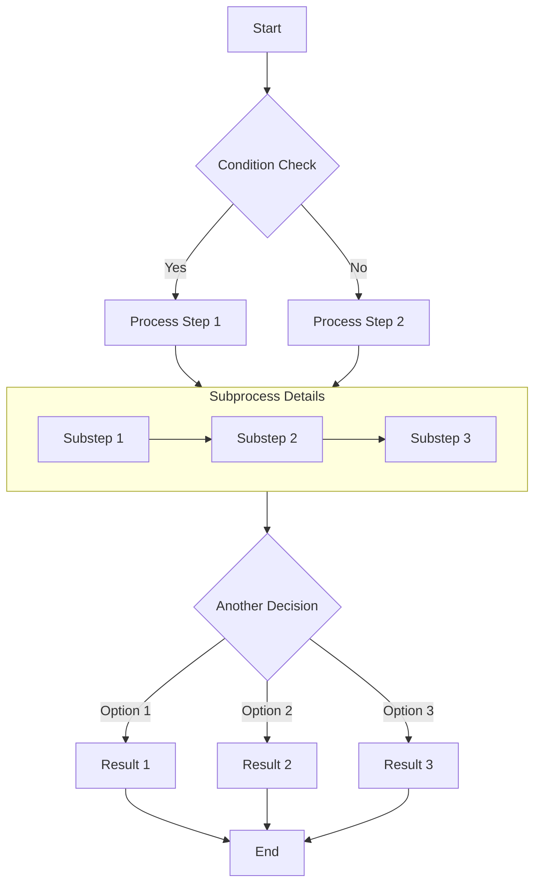

# Complete Guide to Markdown with Mermaid Diagrams

This article demonstrates how to create various complex diagrams using Mermaid in Markdown documents, including flowcharts, sequence diagrams, Gantt charts, class diagrams, and state diagrams.

## Flowchart Example

Flowcharts are excellent for representing processes or algorithm steps.

